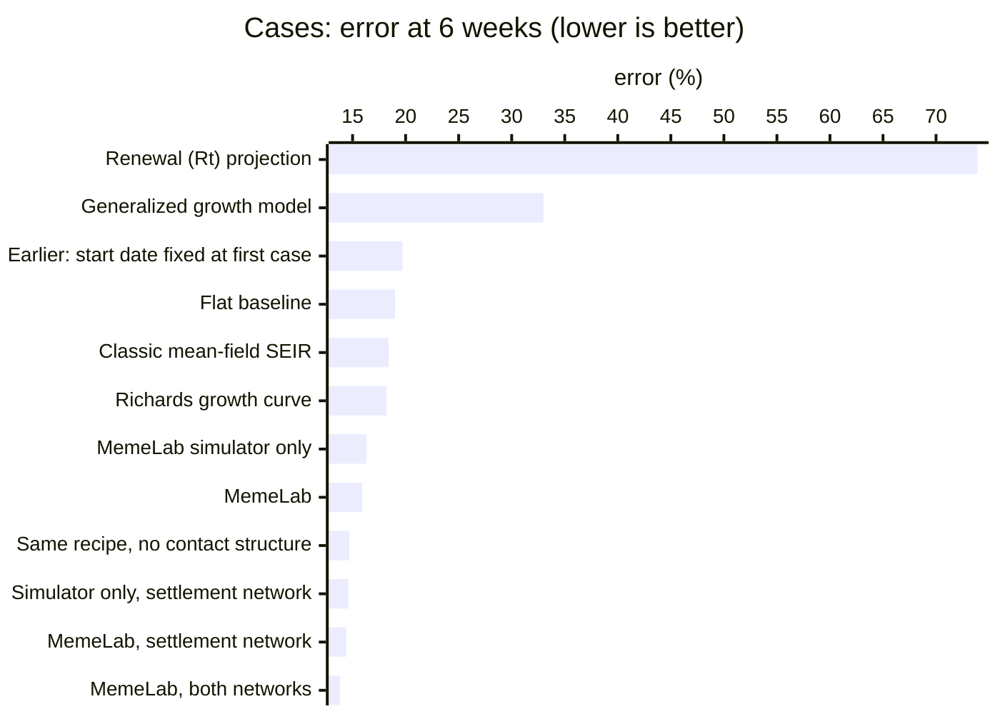
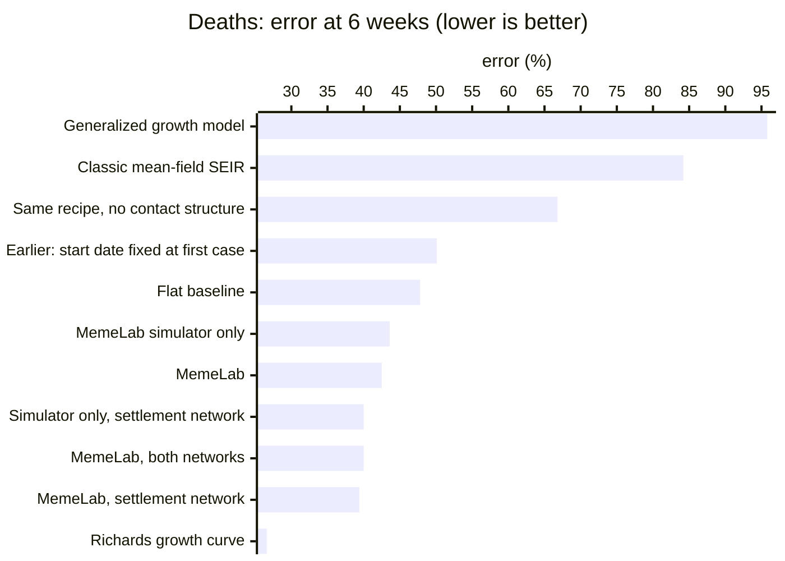
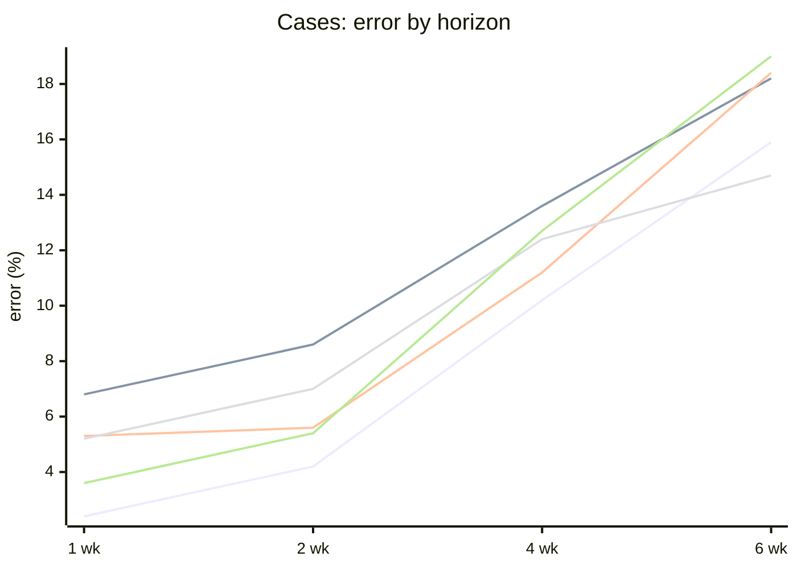
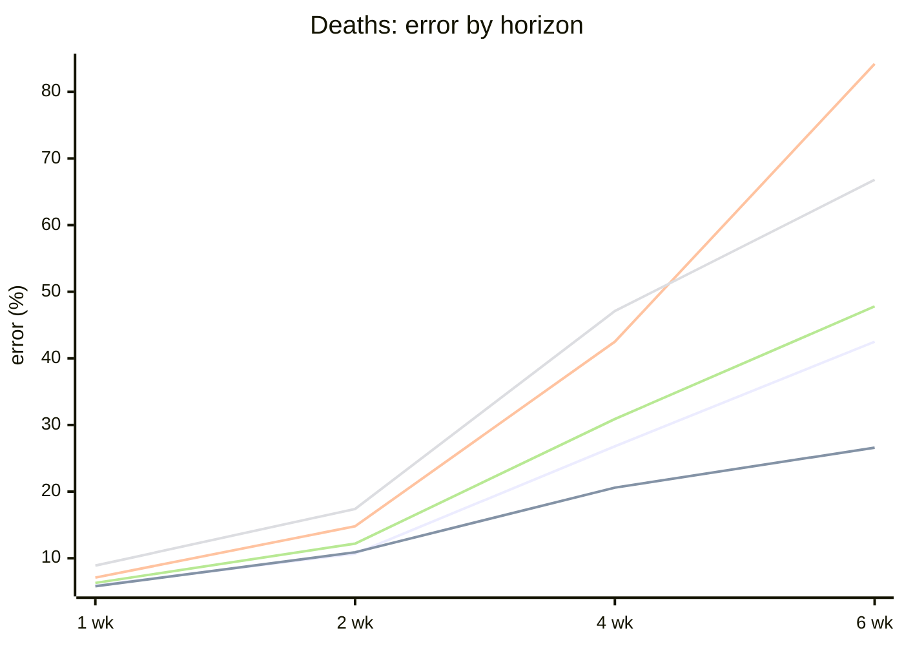

# MemeLab forecasting benchmark

How accurately MemeLab forecasts real human-to-human outbreaks 1, 2, 4 and 6 weeks ahead, compared with the standard forecasting methods, the simple baselines every forecast has to beat, and the published forecasts of the 2026 Bundibugyo ebolavirus outbreak in the Democratic Republic of the Congo.

Generated 2026-09-22 from 12 pathogens, 15 outbreaks and 122 forecast dates, plus 111 confirmation dates.

## Headline

- **Cases:** MemeLab's error in the cumulative case count is **2.4% at 1 week, 4.2% at 2 weeks, 10% at 4 weeks and 16% at 6 weeks**, averaged over the pathogens with a report at each horizon (12 / 12 / 10 / 10 at 1 / 2 / 4 / 6 weeks). The flat baseline scores 3.6% / 5.4% / 13% / 19%.
- **Deaths:** 5.9% / 11% / 27% / 43%, against 6.3% / 12% / 31% / 48% for the flat baseline, averaged over the pathogens with a report at each horizon (7 / 7 / 6 / 6 at 1 / 2 / 4 / 6 weeks).
- **Against the standard models** (Richards curve, classic SEIR, renewal Rt projection, generalized growth model) and both baselines, MemeLab has the lowest 6-week case error; on 6-week deaths the Richards growth curve is lower (27%).
- **On a second set of forecast dates** (each shifted 7 days, not used by the selection rule), MemeLab's 6-week error is 9.8% for cases and 16% for deaths (flat baseline: 16% and 21%).
- **On the 2026 DRC outbreak**, given exactly the data each published forecast used, MemeLab missed the reported count by 8.3% (cases) and 8.2% (deaths) on average, against 13% and 12% for the published forecasts on the same forecasts; MemeLab was closer on 20 of 28 case and 13 of 17 death forecasts. The simple flat baseline scored 7.1% and 9.7%, slightly better than MemeLab on cases.
- **Contact structure:** the same simulator recipe run on a mean-field population (everyone mixing with everyone) has higher death error at every horizon (67% vs 44% for the grid simulator alone at 6 weeks) and higher case error at 1, 2 and 4 weeks (at 6 weeks it is slightly lower: 15% vs 16%).

Off the scale (above 100%): Log-linear trend >1000%.

Off the scale (above 100%): Renewal (Rt) projection 137%, Log-linear trend 823%.

## What MemeLab is doing

MemeLab simulates every person as a cell on a spatial grid, so an outbreak spreads through neighbours and a small share of long-range contacts rather than through a perfectly mixed population (a variant on an irregular settlement network is also benchmarked). For each forecast it is calibrated the way a person would calibrate it by hand in the app: cited incubation and infectious periods for the pathogen; the start of transmission fitted to the data (searched up to 24 weeks before the first report) rather than pinned to a case date, because the simulation models the epidemic, not the surveillance record; the fatality ratio read off the data; a small grid of transmission settings judged against the reported counts; transmission adjusted in three-week phases to follow the data; the forecast lined up with the most recent full week; and, after the forecast date, transmission eased toward level incidence only while the simulated outbreak is still growing. The headline forecast averages the simulator with the flat baseline, an equal-weight two-member ensemble; simple untrained ensembles are hard to beat (Ray et al. 2023).

## Error by horizon

Total-count error: how far the forecast cumulative count is from the count later reported, as a % of that count. Test forecasts only (alternate forecast dates not used by the selection rule).

### Cases

| Method | 1 wk | 2 wk | 4 wk | 6 wk |
|---|---:|---:|---:|---:|
| MemeLab, both networks | 2.0% | 3.7% | 8.2% | 14% |
| MemeLab, settlement network | 2.1% | 3.6% | 8.5% | 14% |
| Simulator only, settlement network | 3.1% | 4.6% | 9.9% | 15% |
| Same recipe, no contact structure | 5.2% | 7.0% | 12% | 15% |
| **MemeLab** | **2.4%** | **4.2%** | **10%** | **16%** |
| MemeLab simulator only | 3.0% | 5.0% | 10% | 16% |
| Richards growth curve | 6.8% | 8.6% | 14% | 18% |
| Classic mean-field SEIR | 5.3% | 5.6% | 11% | 18% |
| Flat baseline | 3.6% | 5.4% | 13% | 19% |
| Earlier: start date fixed at first case | 3.3% | 5.9% | 12% | 20% |
| Generalized growth model | 5.3% | 11% | 20% | 33% |
| Renewal (Rt) projection | 7.3% | 8.5% | 29% | 74% |
| Log-linear trend | 34% | 10% | >1000% | >1000% |

Lines, top to bottom at 6 weeks: Flat baseline · Classic mean-field SEIR · Richards growth curve · MemeLab · Same recipe, no contact structure.

### Deaths

| Method | 1 wk | 2 wk | 4 wk | 6 wk |
|---|---:|---:|---:|---:|
| Richards growth curve | 5.8% | 11% | 21% | 27% |
| MemeLab, settlement network | 5.4% | 10.0% | 26% | 39% |
| MemeLab, both networks | 5.7% | 9.7% | 25% | 40% |
| Simulator only, settlement network | 5.8% | 10% | 26% | 40% |
| **MemeLab** | **5.9%** | **11%** | **27%** | **43%** |
| MemeLab simulator only | 7.0% | 11% | 28% | 44% |
| Flat baseline | 6.3% | 12% | 31% | 48% |
| Earlier: start date fixed at first case | 6.5% | 11% | 31% | 50% |
| Same recipe, no contact structure | 8.9% | 17% | 47% | 67% |
| Classic mean-field SEIR | 7.1% | 15% | 42% | 84% |
| Generalized growth model | 7.1% | 17% | 50% | 96% |
| Renewal (Rt) projection | 6.8% | 16% | 61% | 137% |
| Log-linear trend | 21% | 25% | 184% | 823% |

Lines, top to bottom at 6 weeks: Classic mean-field SEIR · Same recipe, no contact structure · Flat baseline · MemeLab · Richards growth curve.

### The stricter measure: error in the new cases only

The same absolute error as a % of the new cases reported over the horizon.

| Method | 1 wk | 2 wk | 4 wk | 6 wk |
|---|---:|---:|---:|---:|
| Same recipe, no contact structure | 96% | 102% | 129% | 134% |
| MemeLab, both networks | 51% | 59% | 96% | 135% |
| Classic mean-field SEIR | 62% | 53% | 95% | 138% |
| Simulator only, settlement network | 66% | 73% | 110% | 144% |
| MemeLab, settlement network | 50% | 60% | 101% | 149% |
| **MemeLab** | **53%** | **66%** | **103%** | **149%** |
| MemeLab simulator only | 80% | 86% | 118% | 155% |
| Earlier: start date fixed at first case | 74% | 97% | 134% | 191% |
| Richards growth curve | 98% | 111% | 163% | 192% |
| Flat baseline | 75% | 98% | 145% | 213% |
| Generalized growth model | 190% | 311% | 382% | 604% |
| Renewal (Rt) projection | 112% | 103% | 310% | 743% |
| Log-linear trend | 595% | 124% | >1000% | >1000% |

## Head to head

Share of pathogen × horizon comparisons (1, 2, 4 and 6 weeks) in which MemeLab's error is lower (ties excluded). The no-contact-structure row compares the grid simulator alone with the same recipe on a mean-field population, like for like:

| Opponent | Cases | Deaths |
|---|---:|---:|
| Richards growth curve | 29 of 44 (66%) | 16 of 26 (62%) |
| Classic mean-field SEIR | 21 of 44 (48%) | 15 of 26 (58%) |
| Renewal (Rt) projection | 25 of 44 (57%) | 20 of 25 (80%) |
| Generalized growth model | 41 of 44 (93%) | 18 of 26 (69%) |
| Same recipe, no contact structure | 24 of 41 (59%) | 19 of 27 (70%) |
| Flat baseline | 28 of 44 (64%) | 16 of 25 (64%) |
| Log-linear trend | 27 of 44 (61%) | 21 of 25 (84%) |

## By pathogen

MemeLab's case error, with the flat baseline in brackets. — means no report fell within 3 days of that horizon.

| Pathogen | Outbreak | 1 wk | 2 wk | 4 wk | 6 wk |
|---|---|---:|---:|---:|---:|
| SARS-CoV-2 (ancestral) | Italy, Republic of Korea, United States | 1.2% (0.8%) | 1.7% (1.9%) | 6.4% (5.3%) | 8.8% (7.9%) |
| Ebola virus (Zaire) | Sierra Leone, Guinea | 1.3% (1.3%) | 3.9% (3.8%) | 5.1% (5.0%) | 5.9% (9.1%) |
| Bundibugyo virus (Ebola, DRC 2026) | Democratic Republic of the Congo, national totals | 2.7% (3.2%) | 6.7% (7.7%) | 18% (19%) | 26% (26%) |
| Sudan virus (Ebola) | Uganda | 9.3% (8.5%) | 14% (13%) | 33% (29%) | 52% (45%) |
| Marburg virus | Angola | 4.8% (15%) | 10% (16%) | — | — |
| Mpox (clade IIb) | Spain | 1.5% (2.4%) | 3.1% (4.3%) | 5.9% (6.1%) | 8.7% (6.8%) |
| SARS-CoV-1 | Hong Kong Special Administrative Region, China | 0.9% (2.5%) | 1.9% (5.5%) | 4.7% (14%) | 8.6% (22%) |
| MERS-CoV | Republic of Korea-linked outbreak, including one exported case confirmed in China | 0.2% (1.6%) | 1.7% (5.4%) | — | — |
| Influenza A(H1N1)pdm09 | Australia | 0.1% (0.7%) | 0.2% (1.3%) | 0.6% (3.2%) | 1.8% (5.7%) |
| Measles | Texas, United States | 4.0% (2.1%) | 3.4% (3.5%) | 11% (8.6%) | 23% (14%) |
| Diphtheria | Cox’s Bazar district, Bangladesh | 0.3% (0.5%) | 1.1% (0.4%) | 17% (36%) | 24% (52%) |
| Pneumonic plague | Madagascar, national totals | 2.5% (4.1%) | 2.1% (2.1%) | 0.7% (1.7%) | 1.1% (2.5%) |

## 2026 DRC Bundibugyo outbreak: published forecasts vs MemeLab

Every published forecast of this outbreak that states a number, a target date and its data cutoff (45 scoreable so far, from a research catalogue of 2,695 entries; counterfactual scenarios, retrospective forecasts and modelled true-infection counts are excluded), scored against the confirmed counts later reported by the DRC Ministry of Health. MemeLab was given exactly the data each forecast used and asked for the same date.

| Method | Cases: mean error | Closer than the published forecast | Deaths: mean error | Closer than the published forecast |
|---|---:|---:|---:|---:|
| Published forecasts (on the same forecasts as MemeLab) | 13% | — | 12% | — |
| **MemeLab** | 8.3% | 20 of 28 | 8.2% | 13 of 17 |
| MemeLab preset (corrected-series fit), converted to confirmed counts | 20% | 7 of 28 | 33% | 1 of 17 |
| Flat baseline | 7.1% | 21 of 28 | 9.7% | 12 of 17 |

Each published source, on its own forecasts:

| Published forecast | Model class | Forecasts | Its mean error | MemeLab on the same forecasts |
|---|---|---:|---:|---:|
| [Metaculus community (18 Jun report)](https://www.metaculus.com/files/Respiratory-Outlook-Update-June2026) | expert judgement | 1 | 60% | 50% |
| [Chamla et al. 2026 (central scenario)](https://doi.org/10.1016/S1473-3099(26)00320-8) | homogeneous-mixing compartmental | 2 | 29% | 18% |
| [Metaculus community (17 Jul report)](https://www.metaculus.com/files/Respiratory-Outlook-Update-July-2026) | expert judgement | 1 | 23% | 19% |
| [Verheyden et al. 2026 — trend baseline](https://doi.org/10.64898/2026.07.28.26359159) | statistical-phenomenological | 6 | 18% | 14% |
| [Nunn 2026, HeliosForge (Real-World)](https://doi.org/10.5281/zenodo.21986772) | other | 2 | 9.9% | 4.9% |
| [Verheyden et al. 2026 — Bayesian model](https://doi.org/10.64898/2026.07.28.26359159) | statistical-phenomenological | 6 | 9.5% | 14% |
| [epiforecasts BVDOutbreakSize (LSHTM)](https://github.com/epiforecasts/BVDOutbreakSize/releases/download/results-706/analysis.html) | renewal-Rt | 27 | 9.4% | 3.3% |

## Forecast: the next 6 weeks of the DRC outbreak

Made 2026-09-22 from every DRC Ministry of Health report through 2026-09-21 (7,773 confirmed cases, 3,759 confirmed deaths) with the same method used above, and frozen so it can be scored as reports arrive. Model: MemeLab, both networks, chosen by a fixed rule: lowest mean total-count error on this outbreak's past forecast dates (cases and deaths, 2 and 6 weeks, all splits) (MemeLab, both networks 19%, MemeLab simulator only 21%, MemeLab, settlement network 22%, MemeLab 22%, Simulator only, settlement network 23%).

| Week ending | Cases (median) | Cases, 50% range | Cases, 90% range | Deaths (median) | Deaths, 50% range | Deaths, 90% range |
|---|---:|---:|---:|---:|---:|---:|
| 2026-09-28 | 8,165 | 8,103–8,426 | 7,930–8,683 | 3,952 | 3,909–4,066 | 3,808–4,219 |
| 2026-10-05 | 8,571 | 8,442–9,087 | 8,095–9,562 | 4,136 | 4,068–4,379 | 3,885–4,650 |
| 2026-10-12 | 8,965 | 8,787–9,724 | 8,281–10,458 | 4,332 | 4,228–4,719 | 3,954–5,093 |
| 2026-10-19 | 9,367 | 9,142–10,385 | 8,438–11,363 | 4,534 | 4,390–5,067 | 4,033–5,517 |
| 2026-10-26 | 9,783 | 9,462–11,045 | 8,616–12,289 | 4,723 | 4,555–5,401 | 4,098–5,977 |
| 2026-11-02 | 10,197 | 9,833–11,719 | 8,789–13,202 | 4,913 | 4,720–5,753 | 4,165–6,431 |

Input data SHA-256: `5fae683b0b70b194ec7bb91057fad9c781f06aa7f349d16d0dff61eac89a5dd0`.

## Confirmation on a second set of forecast dates

The final MemeLab configuration was chosen on the development forecasts, then checked on 111 new forecast dates (each 7 days after an original one) that the selection rule never used (dates that coincide with an original date are dropped). Earlier MemeLab versions and the comparators had been scored on these dates in previous confirmation runs, so they are a check, not an untouched hold-out:

| Method (cases) | 1 wk | 2 wk | 4 wk | 6 wk |
|---|---:|---:|---:|---:|
| MemeLab simulator only | 1.8% | 4.9% | 7.6% | 8.2% |
| Log-linear trend | 2.5% | 4.0% | >1000% | 8.2% |
| MemeLab, both networks | 1.3% | 3.3% | 9.7% | 9.1% |
| **MemeLab** | **1.3%** | **3.6%** | **9.1%** | **9.8%** |
| Same recipe, no contact structure | 2.2% | 6.2% | 11% | 10% |
| MemeLab, settlement network | 1.6% | 4.0% | 12% | 11% |
| Simulator only, settlement network | 2.8% | 6.5% | 14% | 12% |
| Renewal (Rt) projection | 2.6% | 6.0% | 27% | 12% |
| Richards growth curve | 2.8% | 7.9% | 13% | 13% |
| Classic mean-field SEIR | 2.3% | 6.6% | 13% | 14% |
| Earlier: start date fixed at first case | 1.7% | 3.8% | 15% | 14% |
| Flat baseline | 1.9% | 4.1% | 13% | 16% |
| Generalized growth model | 5.8% | 13% | 56% | 37% |

| Method (deaths) | 1 wk | 2 wk | 4 wk | 6 wk |
|---|---:|---:|---:|---:|
| MemeLab, both networks | 4.6% | 5.2% | 8.4% | 15% |
| **MemeLab** | **4.4%** | **4.8%** | **8.8%** | **16%** |
| MemeLab simulator only | 4.7% | 5.8% | 11% | 17% |
| MemeLab, settlement network | 4.9% | 5.7% | 9.7% | 17% |
| Classic mean-field SEIR | 36% | 9.9% | >1000% | 21% |
| Earlier: start date fixed at first case | 4.2% | 6.7% | 9.4% | 21% |
| Flat baseline | 4.9% | 7.1% | 11% | 21% |
| Log-linear trend | 6.4% | 8.8% | 16% | 24% |
| Simulator only, settlement network | 6.1% | 6.8% | 14% | 24% |
| Richards growth curve | 6.3% | 15% | 21% | 24% |
| Same recipe, no contact structure | 5.2% | 6.2% | 19% | 36% |
| Renewal (Rt) projection | 9.3% | 9.5% | >1000% | 38% |
| Generalized growth model | 9.1% | 15% | 34% | 68% |

## How the benchmark works

- **Tasks.** 12 human-to-human pathogens, each tested on real outbreaks: SARS-CoV-2 (ancestral), Ebola virus (Zaire), Bundibugyo virus (Ebola, DRC 2026), Sudan virus (Ebola), Marburg virus, Mpox (clade IIb), SARS-CoV-1, MERS-CoV, Influenza A(H1N1)pdm09, Measles, Diphtheria, Pneumonic plague.
- **Forecast dates.** From the first report with at least 30 cases and 4 weeks of history, every 14 days while 6 weeks of follow-up exist (at most 12 per outbreak). Alternate dates form the development and test sets; methods are only ever tuned on development dates.
- **No peeking.** A method sees only reports up to the forecast date; a unit test changes the future data and checks the model input does not change.
- **Truth.** The published series exactly as downloaded, downward revisions kept, no interpolation. The target for a horizon is the first report within 3 days of it.
- **Aggregation.** Median over each pathogen's forecasts, then the mean over pathogens, so every pathogen counts once.
- **Baselines and comparators.** Flat baseline (the COVID-19 Forecast Hub baseline); log-linear trend; generalized growth model (Viboud, Simonsen & Chowell 2016); Richards curve (Chowell 2017); renewal-equation Rt projection (Cori et al. 2013; Nouvellet et al. 2018); classic mean-field SEIR.
- **Caveats.** Retrospective: final archived data rather than what was available on each date. Error rates are on reported counts, not true infections. Small outbreaks have few forecast dates, and MERS and Marburg have no 4- or 6-week targets because reports thin out.

## Data sources

- **SARS-CoV-2 (ancestral)** (model stages: latent 3 d, infectious 5 d, chosen to match the cited serial interval; incubation: Alene M, Yismaw L, Assemie MA, Ketema DB, Gietaneh W, Birhan TY. Serial interval and incubation period of COVID-19: a systematic review and meta-analysis. BMC Infect Dis. 2021): COVID-19 — Italy, 2020 ([data](https://raw.githubusercontent.com/CSSEGISandData/COVID-19/master/csse_covid_19_data/csse_covid_19_time_series/time_series_covid19_confirmed_global.csv), first of 2 source files; all listed in the benchmark's outbreak file); COVID-19 — Korea, South, 2020 ([data](https://raw.githubusercontent.com/CSSEGISandData/COVID-19/master/csse_covid_19_data/csse_covid_19_time_series/time_series_covid19_confirmed_global.csv), first of 2 source files; all listed in the benchmark's outbreak file); COVID-19 — US, 2020 ([data](https://raw.githubusercontent.com/CSSEGISandData/COVID-19/master/csse_covid_19_data/csse_covid_19_time_series/time_series_covid19_confirmed_global.csv), first of 2 source files; all listed in the benchmark's outbreak file)
- **Ebola virus (Zaire)** (model stages: latent 11 d, infectious 9 d, chosen to match the cited serial interval; incubation: WHO Ebola Response Team. Ebola virus disease in West Africa - the first 9 months of the epidemic and forward projections. N Engl J Med. 2014): Ebola — Sierra Leone, 2014–2015 ([data](https://data.humdata.org/dataset/0d089fa0-3567-4b01-9c03-39d340ff34e3/resource/c59b5722-ca4b-41ca-a446-472d6d824d01/download/ebola_data_db_format.csv), first of 2 source files; all listed in the benchmark's outbreak file); Ebola — Guinea, 2014–2015 ([data](https://data.humdata.org/dataset/0d089fa0-3567-4b01-9c03-39d340ff34e3/resource/c59b5722-ca4b-41ca-a446-472d6d824d01/download/ebola_data_db_format.csv), first of 2 source files; all listed in the benchmark's outbreak file)
- **Bundibugyo virus (Ebola, DRC 2026)** (model stages: latent 6 d, infectious 10 d, chosen to match the cited serial interval; incubation: MacNeil A, Farnon EC, Wamala J, et al. Proportion of deaths and clinical features in Bundibugyo Ebola virus infection, Uganda. Emerg Infect Dis. 2010): 17th Ebola disease outbreak in the Democratic Republic of the Congo, caused by Bundibugyo virus; detected 14 May 2026 (INRB), declared 15 May 2026; ongoing at 2026-09-22. WHO PHEIC declared 17 May 2026. ([data](http://web.archive.org/web/20260614105948id_/https://www.ecdc.europa.eu/en/ebola-outbreak-democratic-republic-congo-and-uganda), first of 198 source files; all listed in the benchmark's outbreak file)
- **Sudan virus (Ebola)** (model stages: latent 6 d, infectious 11 d, chosen to match the cited serial interval; incubation: Kabami Z, Ario AR, Harris JR, et al. Ebola disease outbreak caused by the Sudan virus in Uganda, 2022: a descriptive epidemiological study. Lancet Glob Health. 2024): Sudan virus disease outbreak, Uganda, declared 20 Sep 2022, declared over 11 Jan 2023 ([data](https://www.afro.who.int/sites/default/files/2022-10/10%20EVD_MubendeRegion_SitRep%2310.pdf), first of 98 source files; all listed in the benchmark's outbreak file)
- **Marburg virus** (model stages: latent 7 d, infectious 8 d, chosen to match the cited serial interval; incubation: Pavlin BI. Calculation of incubation period and serial interval from multiple outbreaks of Marburg virus disease. BMC Res Notes. 2014): Marburg haemorrhagic fever outbreak, Angola (Uíge Province epicentre), Oct 2004-Jul 2005; identified 21-23 Mar 2005, declared over 7 Nov 2005 ([data](https://www.who.int/emergencies/disease-outbreak-news/item/2005DON109), first of 28 source files; all listed in the benchmark's outbreak file)
- **Mpox (clade IIb)** (model stages: latent 8 d, infectious 9 d, chosen to match the cited serial interval; incubation: Diaz Brochero C, Nocua-Baez LC, Cortes JA, et al. Decoding mpox: a systematic review and meta-analysis of the transmission and severity parameters of the 2022-2023 global outbreak. BMJ Glob Health. 2025): Mpox — Spain, 2022 ([data](https://opendata.ecdc.europa.eu/monkeypox/casedistribution/csv/data.csv))
- **SARS-CoV-1** (model stages: latent 6 d, infectious 5 d, chosen to match the cited serial interval; incubation: Donnelly CA, Ghani AC, Leung GM, et al. Epidemiological determinants of spread of causal agent of severe acute respiratory syndrome in Hong Kong. Lancet. 2003): 2003 severe acute respiratory syndrome outbreak ([data](https://raw.githubusercontent.com/imdevskp/sars-2003-outbreak-data-webscraping-code/master/sars_2003_complete_dataset_clean.csv), first of 17 source files; all listed in the benchmark's outbreak file)
- **MERS-CoV** (model stages: latent 6 d, infectious 12 d, chosen to match the cited serial interval; incubation: Cauchemez S, Fraser C, Van Kerkhove MD, et al. Middle East respiratory syndrome coronavirus: quantification of the extent of the epidemic, surveillance biases, and transmissibility. Lancet Infect Dis. 2014): 2015 Republic of Korea-linked MERS outbreak ([data](https://www.ecdc.europa.eu/en/news-events/epidemiological-update-middle-east-respiratory-syndrome-coronavirus-mers-cov-18-august), first of 18 source files; all listed in the benchmark's outbreak file)
- **Influenza A(H1N1)pdm09** (model stages: latent 1 d, infectious 4 d, chosen to match the cited serial interval; incubation: Lessler J, Reich NG, Cummings DAT, New York City Department of Health and Mental Hygiene Swine Influenza Investigation Team. Outbreak of 2009 pandemic influenza A (H1N1) at a New York City school. N Engl J Med. 2009): 2009 pandemic influenza wave in Australia ([data](https://xmart-api-public.who.int/FLUMART/VIW_FNT?%24format=csv&%24filter=COUNTRY_CODE+eq+%27AUS%27+and+ISO_YEAR+eq+2009), first of 2 source files; all listed in the benchmark's outbreak file)
- **Measles** (model stages: latent 8 d, infectious 8 d, chosen to match the cited serial interval; incubation: Lessler J, Reich NG, Brookmeyer R, Perl TM, Nelson KE, Cummings DAT. Incubation periods of acute respiratory viral infections: a systematic review. Lancet Infect Dis. 2009): 2025 West Texas measles outbreak (Texas-resident outbreak-associated cases) ([data](https://datawrapper.dwcdn.net/40WgF/31/data.csv), first of 15 source files; all listed in the benchmark's outbreak file)
- **Diphtheria** (model stages: latent 1 d, infectious 14 d, chosen to match the cited serial interval; incubation: Truelove SA, Keegan LT, Moss WJ, et al. Clinical and epidemiological aspects of diphtheria: a systematic review and pooled analysis. Clin Infect Dis. 2020): Diphtheria among Rohingya refugees and nearby host communities, November 2017–May 2018 ([data](https://scienceportal.msf.org/api/assets/4482/download/8787?filename=bitstream_3507213.pdf), first of 29 source files; all listed in the benchmark's outbreak file)
- **Pneumonic plague** (model stages: latent 4 d, infectious 2 d, chosen to match the cited serial interval; incubation: Gani R, Leach S. Epidemiologic determinants for modeling pneumonic plague outbreaks. Emerg Infect Dis. 2004): Urban pneumonic plague epidemic, Madagascar, 1 Aug - 26 Nov 2017 (index case fell ill 23-27 Aug 2017; outbreak detected 11 Sep and notified to WHO 13 Sep 2017; Ministry of Health announced containment of the acute urban pneumonic epidemic on 25/27 Nov 2017), followed by the remainder of the 2017-18 plague season (WHO AFRO closed the event after April 2018). ([data](https://raw.githubusercontent.com/emilylaiken/outbreak-nowcasting/master/data/madagascar/madagascarreports.csv), first of 64 source files; all listed in the benchmark's outbreak file)

## References

- Ray EL et al. Comparing trained and untrained probabilistic ensemble forecasts of COVID-19 cases and deaths in the United States. Int J Forecast 2023;39:1366–1383.
- Viboud C, Simonsen L, Chowell G. A generalized-growth model to characterize the early ascending phase of infectious disease outbreaks. Epidemics 2016;15:27–37.
- Chowell G. Fitting dynamic models to epidemic outbreaks with quantified uncertainty: a primer for parameter uncertainty, identifiability, and forecasts. Infect Dis Model 2017;2:379–398.
- Nouvellet P et al. A simple approach to measure transmissibility and forecast incidence. Epidemics 2018;22:29–35.
- Cori A, Ferguson NM, Fraser C, Cauchemez S. A new framework and software to estimate time-varying reproduction numbers during epidemics. Am J Epidemiol 2013;178:1505–1512.
