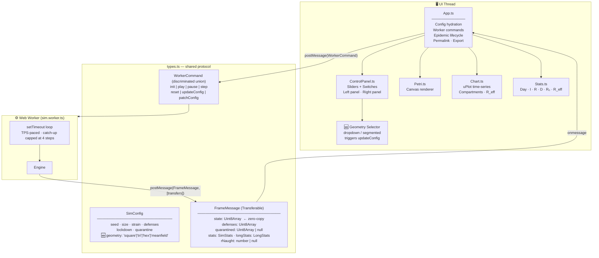
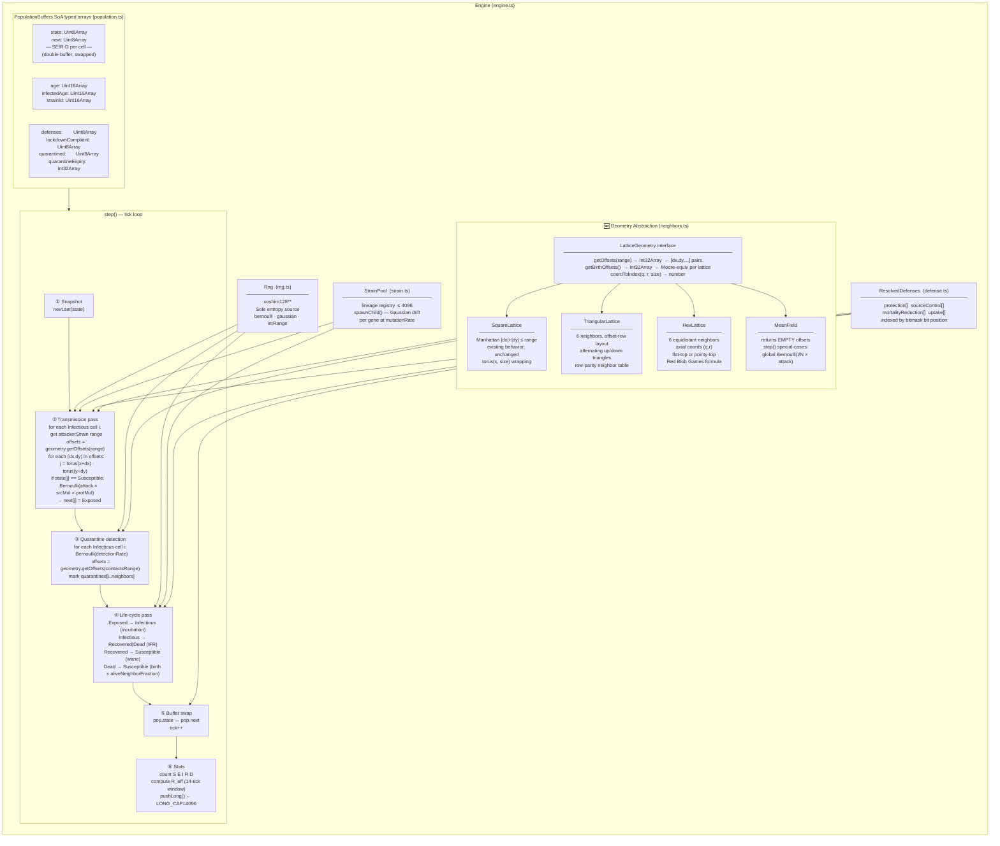
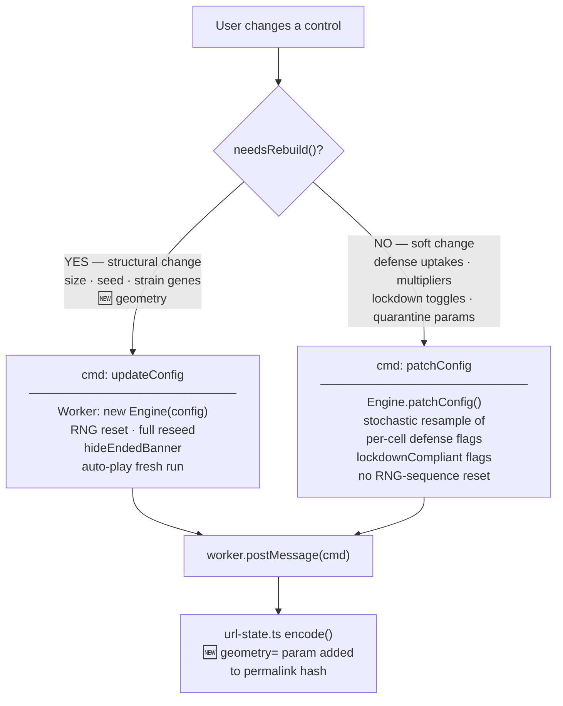
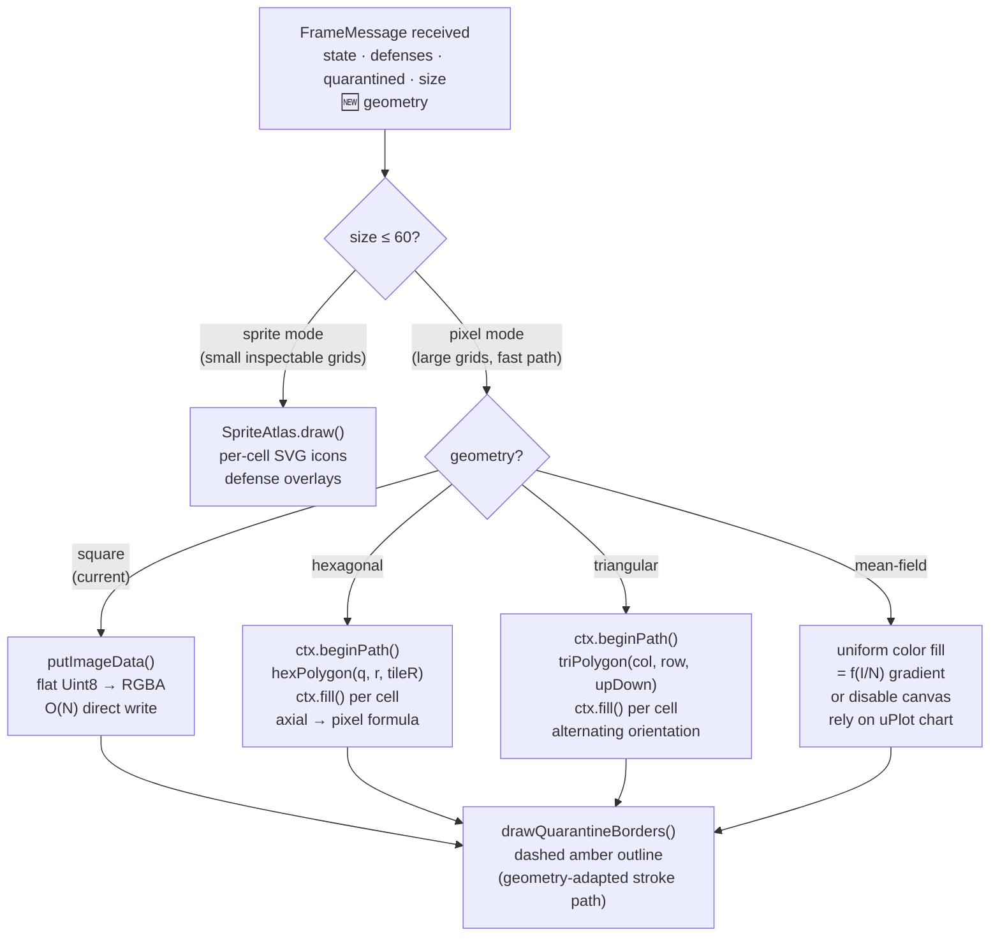
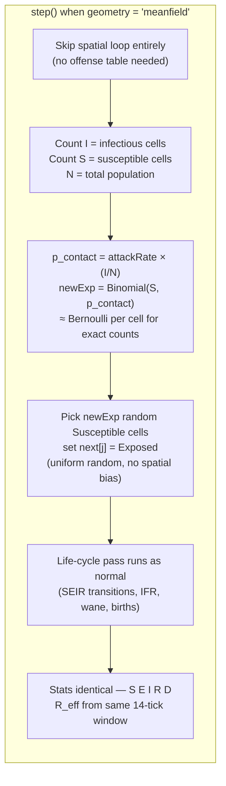

# MemeLabV3 — Geometry-Extended Engine Architecture

## System Overview

---

## Engine Internals + Geometry Abstraction

---

## Config Change Routing  (App.ts → Worker)

---

## Petri Renderer — Geometry-Aware Paint Path  (Petri.ts)

---

## Mean-Field Special Case  (inside Engine.step())

